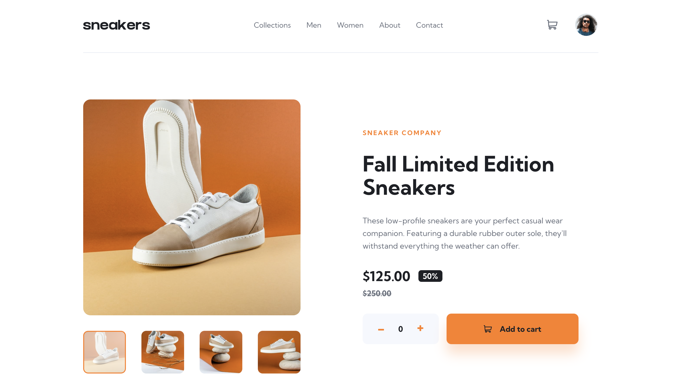
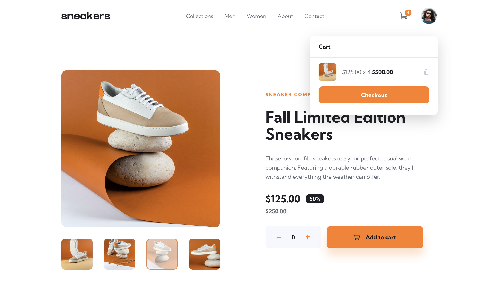
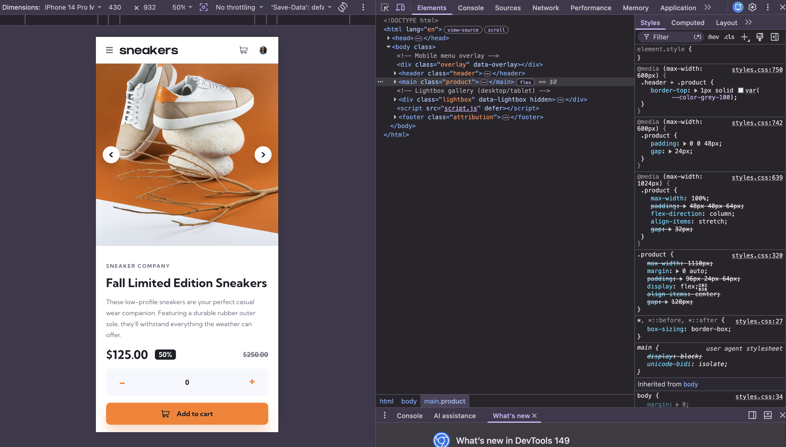

# Frontend Mentor - E-commerce product page solution

This is a solution to the [E-commerce product page challenge on Frontend Mentor](https://www.frontendmentor.io/challenges/ecommerce-product-page-UPsZ9MJp6). Frontend Mentor challenges help you improve your coding skills by building realistic projects.

# Sneakerz Card

This is a responsive e-commerce product page built with plain HTML, CSS, and JavaScript. The interface recreates a premium sneaker product layout with a working image gallery, cart, mobile navigation, and desktop lightbox.

## Table of contents

- [Overview](#overview)
  - [The challenge](#the-challenge)
  - [Features](#features)
  - [Getting Started](#getting-started)
  - [Screenshot](#screenshot)
  - [Links](#links)
- [My process](#my-process)
  - [Tech Stack](#tech-stack)
  - [Project Structure](#project-structure)
  - [What I learned](#what-i-learned)
  - [Continued development](#continued-development)
  - [Useful resources](#useful-resources)
  - [AI Collaboration](#ai-collaboration)
- [Author](#author)
- [Acknowledgments](#acknowledgments)

## Overview

This project is based on the Frontend Mentor product page challenge and has been adapted into a custom implementation for the Sneakerz Card experience.

### The challenge

Users should be able to:

- View the optimal layout for the site depending on their device's screen size
- See hover states for all interactive elements on the page
- Open a lightbox gallery by clicking on the large product image
- Switch the large product image by clicking on the small thumbnail images
- Add items to the cart
- View the cart and remove items from it

### Features

- Responsive layout for desktop, tablet, and mobile
- Product image gallery with thumbnail switching
- Desktop lightbox gallery
- Mobile slide-out navigation
- Add-to-cart quantity selector
- Cart dropdown with remove item support
- Active navigation and accessible interaction states

### Getting Started

1. Open `index.html` in a browser, or use a local server for the best experience.
2. Interact with the gallery thumbnails and arrow controls.
3. Add items to the cart, open the cart dropdown, and remove items as needed.

### Screenshot

Well, these are the sample screenshots of the project to help you get a feel for what it's like.







### Links

- Solution URL: [This link is coming soon once the solution is submitted.](https://your-solution-url.com)
- Live Site URL: [This link is coming soon once the solution is hosted live.](https://your-live-site-url.com)

## My process

### Tech Stack

- Semantic HTML5 markup
- CSS custom properties
- Vanilla JavaScript
- Google Fonts: Kumbh Sans

### Project Structure

- `index.html` - page markup and interactive sections
- `images/` - optimized project assets
- `script.js` - gallery, cart, and menu behavior
- `styles.css` - layout, responsive rules, and visual styling

### What I learned

Below are some of the valuable information I have acquired when working and practicing my development skills on this project.
- I have learned and reinforced how "nav", "ul", "li", and "a" elements help create accessible, structured menus.

- Improved understanding of spacing, max-width, and text alignment for footer/attribution content across screen sizes.

- Learned how to update the cart UI based on quantity, including showing an empty-cart state when the count reaches zero.

- Practiced wiring interactive elements with data attributes for menu toggles and navigation links, which keeps the HTML organized and easier to target in JavaScript.

- Also Learned how to use hover styles to make links feel interactive and polished.

- And overall the project strengthened skills in DOM updates, accessible markup, and responsive UI styling

You can have a look at the code snippets as showed below:⬇️👇

```html
<nav class="nav" data-nav>
          <button
            class="icon-btn close-btn"
            data-menu-close
            aria-label="Close menu"
          >
            <span class="icon icon--close"></span>
          </button>
          <ul class="nav__list" data-nav-list>
            <li><a href="#" data-nav-link>Collections</a></li>
            <li><a href="#" data-nav-link>Men</a></li>
            <li><a href="#" data-nav-link>Women</a></li>
            <li><a href="#" data-nav-link>About</a></li>
            <li><a href="#" data-nav-link>Contact</a></li>
          </ul>
        </nav>
```
```css
.attribution {
  max-width: 1110px;
  margin: 0 auto;
  padding: 0 24px 32px;
  text-align: center;
  color: var(--color-grey-500);
  font-size: 14px;
  line-height: 1.6;
}
.attribution a {
  color: var(--color-orange-500);
  font-weight: 700;
}
.attribution a:hover {
  color: var(--color-orange-300);
}
```
```js
function renderCart() {
    if (cartQuantity <= 0) {
        cartCountEl.hidden = true;
        cartBody.innerHTML = '<p class="cart__empty">Your cart is empty.</p>';
        return;
    }
}
```

### Continued development

- Improve the cart logic so quantities can be updated directly inside the cart.

- Refine the mobile navigation and lightbox interactions for even smoother transitions.

- Explore more advanced accessibility features, such as stronger focus states and keyboard support.

- Continue practicing JavaScript state management for cleaner UI updates.

- Revisit responsive spacing and alignment to make the layout feel even more polished across all screen sizes.

### Useful resources

- [Frontend Mentor](https://www.frontendmentor.io) - Helpful for practicing real-world UI implementation from design references. I liked the structure of the challenges and will keep using this pattern.
- [MDN Web Docs](https://developer.mozilla.org/) - A reliable reference for HTML, CSS, and JavaScript details. This helped reinforce core concepts and is useful when I need clear explanations.
- [CSS-Tricks](https://css-tricks.com/) - Useful for layout and styling techniques. I found the practical examples especially helpful for refining responsive UI work.
- [JavaScript.info](https://javascript.info/) - Helped strengthen understanding of DOM manipulation and event handling. I would recommend it for anyone building interactive interfaces.

### AI Collaboration

- I used AI tools, including GitHub Copilot and ChatGPT, to help with brainstorming, and debugging this project. 

- They were useful for quickly generating ideas, checking syntax, and improving wording in documentation.

- What worked well was using AI to speed up repetitive tasks and get quick guidance when I was stuck.

- What did not work as well was relying on AI for final design decisions, since the interface still needed manual testing and adjustments to match the intended user experience.

## Author

- Website - [Joke wizzo](https://www.wizzoviz.tech/)
- Twitter - [Stillwizzo](https://x.com/stillwizzo)
- LinkedIn - [Kuach John](https://www.linkedin.com/in/kuach-john-565ab62aa/) 
- Frontend Mentor - [Kuach-joke](https://www.frontendmentor.io/profile/Kuach-joke)

## Acknowledgments

Frontend Mentor for providing the challenge and design inspiration.

The open web community for helpful documentation and examples throughout development.

GitHub Copilot and ChatGPT for support with brainstorming, debugging, and refining project ideas. 

Some of my close friends who helped in sharing out some useful insights for development.

